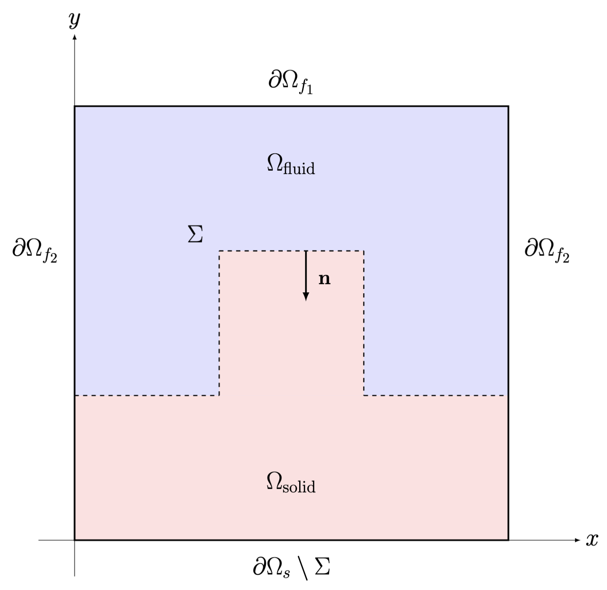

# Monolithic FSI Solver

A simple monolithic fluid-structure interaction solver built on [deal.II](https://www.dealii.org/). Course project for Numerical Methods for Partial Differential Equations at Politecnico di Milano.

## Problem description

Solves a steady, linear fluid-structure interaction problem that couples the Stokes equations with linear elasticity across a fluid-solid interface $\Sigma$, under the small displacements assumption. The system is assembled and solved monolithically in both 2D and 3D.

<p align="center">
  
</p>

## Project structure
```
src/
├── FSIParallel.hpp / .cpp    # Parallel solver (MPI + OpenMP)
├── FSI.hpp / .cpp            # Sequential solver
├── simulate_parallel.cpp     # Parallel entry point
└── simulate_serial.cpp       # Serial entry point
```

## Numerical methods

- **Discretization:** Finite element method with Taylor-Hood elements (Q2/Q1) for the Stokes subsystem and Q2 elements for the displacement field.
- **Linear solver:** GMRES with a block-triangular preconditioner that uses the saddle-point structure of the monolithic system. The velocity and displacement blocks are approximated by AMG V-cycles; the Schur complement is approximated by a scaled pressure mass matrix.
- **Mesh adaptivity:** Adaptive refinement based on the Kelly error estimator.
- **Parallelism:** Hybrid MPI + OpenMP parallelism through Trilinos distributed linear algebra.

## Dependencies

- deal.II ≥ 9.3
- Trilinos
- Boost ≥ 1.72
- MPI + OpenMP

## Build and run
```bash
mkdir build && cd build
cmake -DDEAL_II_DIR=/path/to/dealii ..
make
```

**Serial:**
```bash
./fsi_test_serial
```

**Parallel:**
```bash
mpirun -n 4 ./fsi_test_parallel
```

To switch between 2D and 3D, set `static constexpr unsigned int dim` in `FSIParallel.hpp` before building.

## Output

Results are exported in VTK format and can be opened with [ParaView](https://www.paraview.org/).

## Documentation

The `doc/` folder contains:
- **Report** — Covers the strong and weak formulations, the discretization, the preconditioning strategy, and strong/weak scaling results on the MOX-HPC cluster.
- **Slides** — Slides we used to present the project.

## Authors

Paolo Potì, Giulia Cavoletti, Matteo Parimbelli, Federico Pizzolato

## References

- [deal.II step-46](https://www.dealii.org/current/doxygen/deal.II/step_46.html)