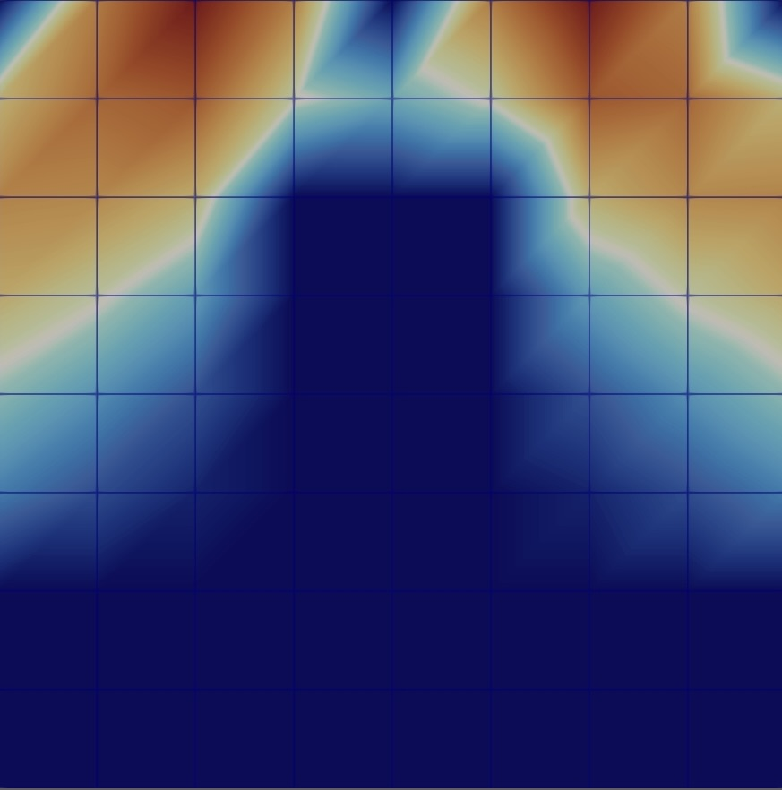
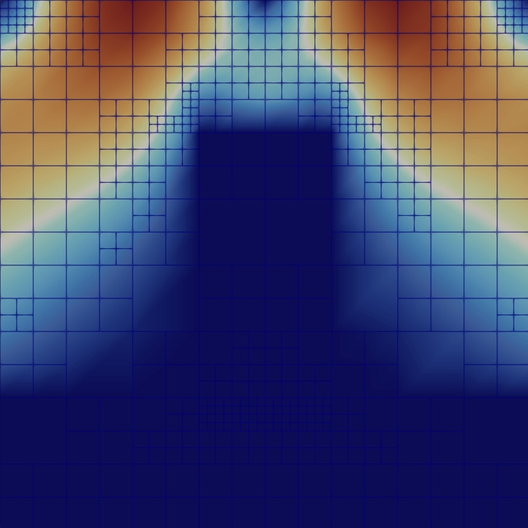
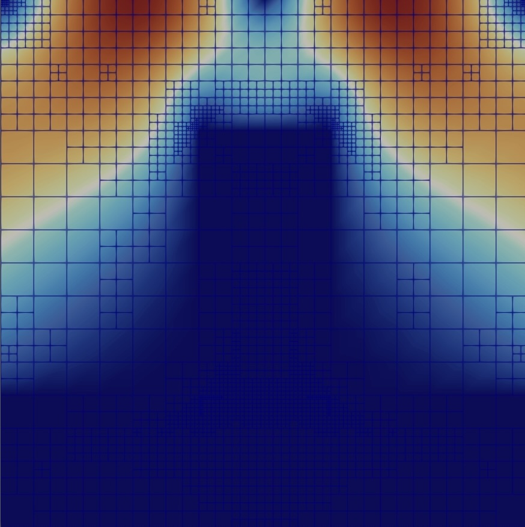
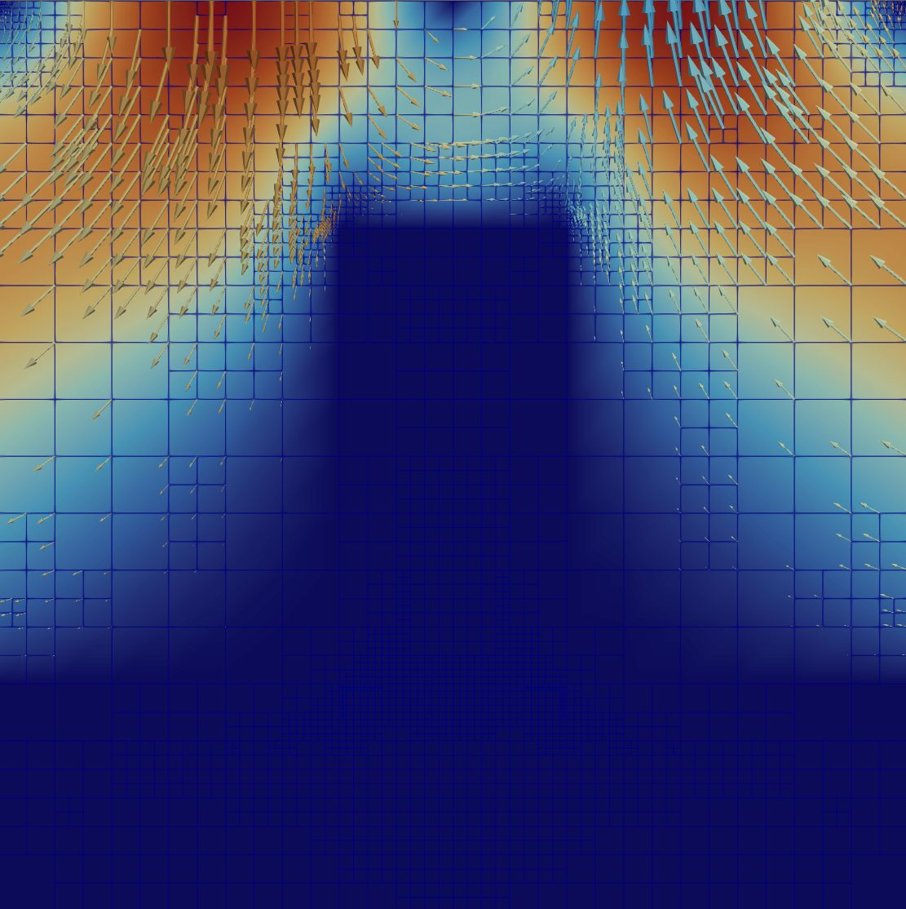
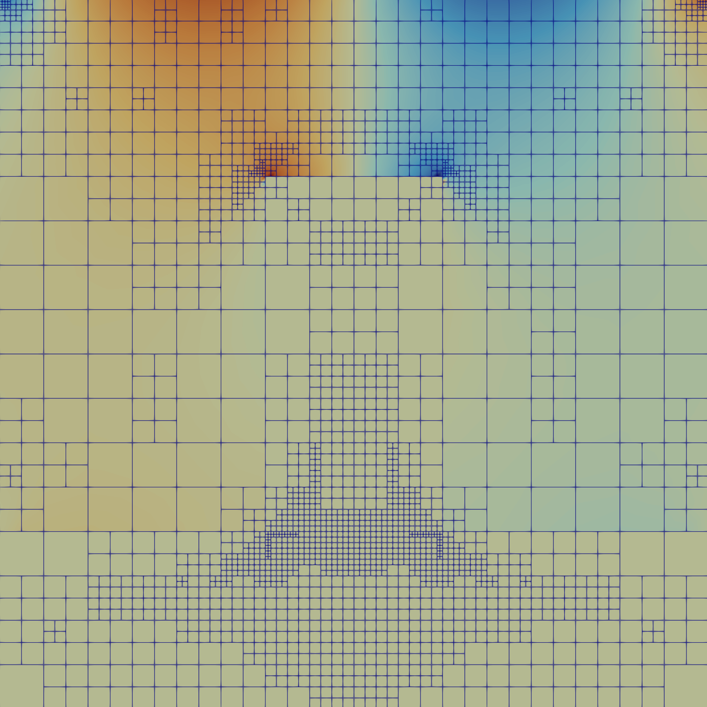
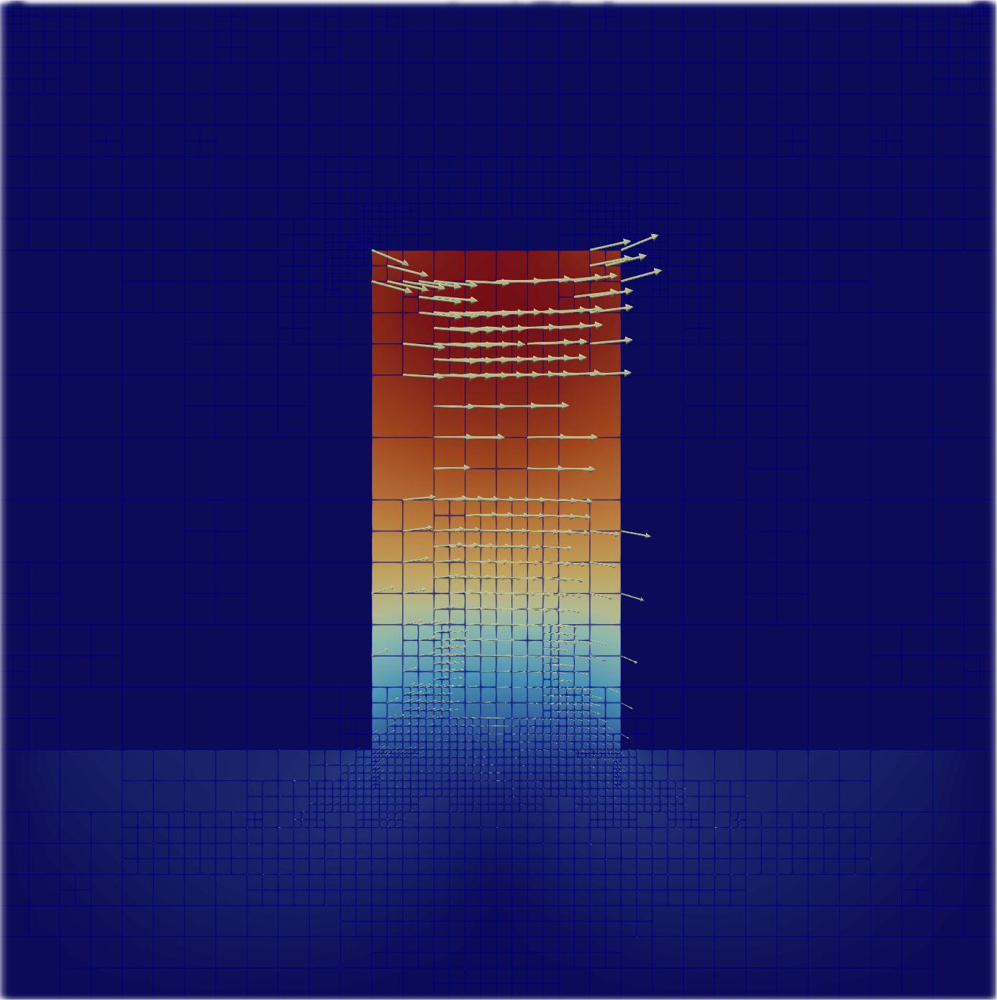
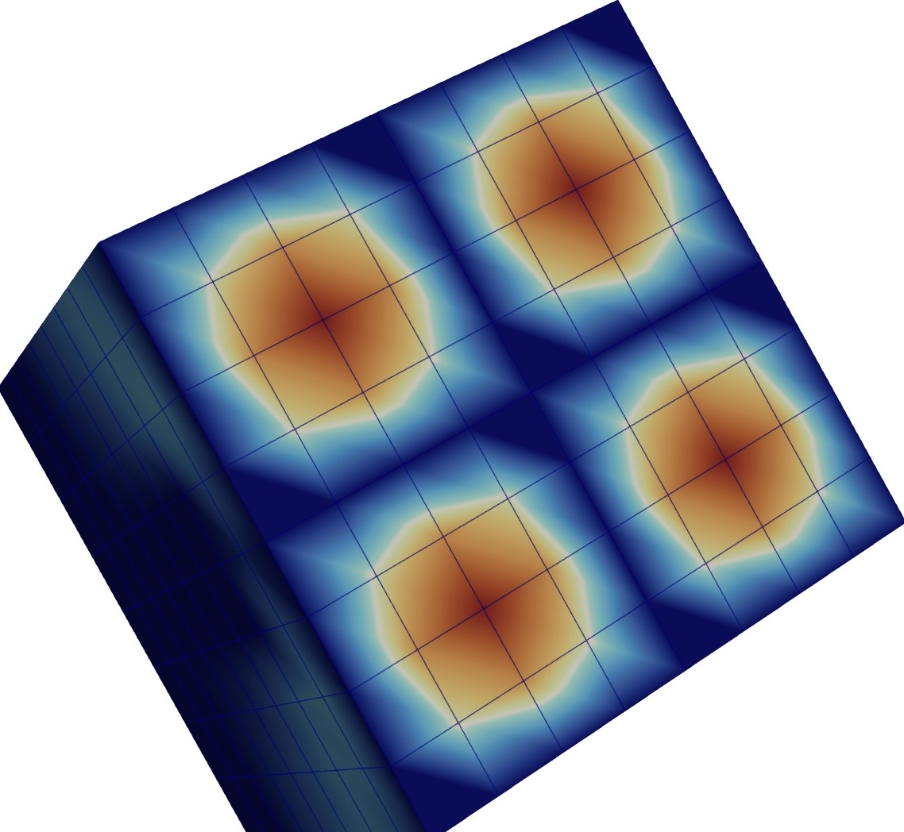
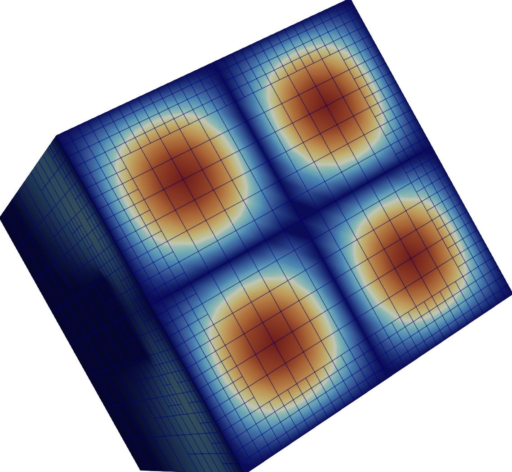
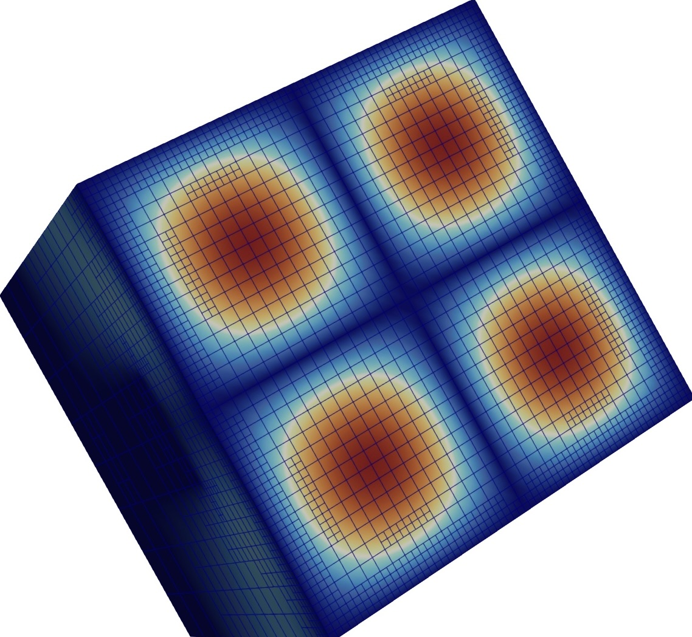

# Implementation of a Fluid-Solid Interaction Solver

Authors: Paolo Potì, Giulia Cavoletti, Matteo Parimbelli, Federico Pizzolato

## Weak Formulation

$$\begin{cases}
 -\nu\Delta\mathbf{u} + \nabla p = 0  & \text{in } \Omega_{\text{fluid}},\\
 \nabla \cdot \mathbf{u} = 0 & \text{in } \Omega_{\text{fluid}},\\
 -\nabla \cdot \sigma(\mathbf{d}) = 0 & \text{in } \Omega_{\text{solid}},\\
 \mathbf{u} = 0 & \text{on } \Sigma=\partial \Omega_{\text{fluid}}\cap \partial \Omega_{s},\\
 \mathbf{u} = \boldsymbol{\varphi} & \text{on }  \partial\Omega_{f1},\\
 \nu\nabla \mathbf{u}  \mathbf{n} - p\mathbf{n} = 0 & \text{on } \partial\Omega_{f2},\\
 \mathbf{d} = 0 & \text{on } \partial\Omega_{s},\\
 \sigma(\mathbf{d})\mathbf{n} = \nu\nabla \mathbf{u}  \mathbf{n} - p\mathbf{n} & \text{on } \Sigma
\end{cases}$$

Starting from the classical formulation of a fluid-solid interaction problem, we multiply each equation by test functions $\mathbf{v}, q, \mathbf{b}$ belonging to spaces $\mathbb{V}$, $\mathbb{Q}$, $\mathbb{B}$ that we will define later and integrate over the two different domains.

$$\int_{\Omega_f}(-\nu\Delta\mathbf{u} + \nabla p) \cdot \mathbf{v} \, d\mathbf{x}= 0$$

We apply Green's first identity and divergence theorem to obtain

$$\int_{\Omega_f}\nu\nabla\mathbf{u}:\nabla{\mathbf{v}} \,d\mathbf{x} -\int_{\partial\Omega_f}\nu\nabla \mathbf{u}\mathbf{n}\cdot \mathbf{v} \, d\Gamma -\int_{\Omega_f}p\nabla \cdot \mathbf{v} \,d\mathbf{x} + \int_{\partial\Omega_f}p\mathbf{n}\cdot \mathbf{v} = 0$$

We can see that $\partial \Omega_f = \Sigma \cup \partial \Omega_{f1} \cup \partial\Omega_{f2}$, where by $\Omega_{f1}$ we mean the upper part of the fluid boundary, so the integral can be decomposed as the sum of the integral on the single boundaries. We can group the two integrals and see that we get on $\partial\Omega_{f2}$ the free-flow term, which is zero, and then makes the integral equal to zero. On $\partial\Omega_{f1}$ and $\Sigma$ we take $\mathbf{v} = 0$ because we are imposing Dirichlet boundary conditions. So $\mathbf{v}$ belongs to the space

$$V_0 = \{\mathbf{v}\in[H^1(\Omega_f)]^2 : \mathbf{v}|_{\Gamma_D} = 0\}$$

For the second equation we get

$$\int_{\Omega_f}\nabla\cdot \mathbf{u} \,q = 0$$

Since $\Gamma_N \neq \emptyset$ $q$ belongs to the space

$$\mathbb{Q} = L^2(\Omega_f)$$

So the weak formulation for the Stokes problem reads: find $\mathbf{u}\in V = \{\mathbf{v} \in [H^1(\Omega_f)]^2 : \mathbf{v}|_{\Sigma} = 0, \mathbf{v}|_{\partial \Omega_{f1}} = 0\}$, $p\in\mathbb{Q}$ such that

$$\begin{cases}
    a(\mathbf{u}, \mathbf{v}) + b(\mathbf{v}, p) = 0 &\forall\,\mathbf{v} \in  V_0\\
    b(\mathbf{u}, q) = 0 & \forall\, q \in \mathbb{Q}
\end{cases}$$

The two spaces for velocity do not coincide which is not suitable for applying Lax–Milgram lemma. We then proceed by applying a lifting of the boundary data. We write $\mathbf{u} = \mathbf{u}_0 + R_{\varphi}$, where $\mathbf{u}_0 \in V_0$ and $R_{\varphi} \in V$ is an arbitrary lifting function such that $R_{\varphi} = \boldsymbol{\varphi}$ on $\partial\Omega_{f1}$. So the weak formulation becomes: find $\mathbf{u}_0\in V_0$, $p\in\mathbb{Q}$ such that

$$\begin{cases}
    a(\mathbf{u}_0, \mathbf{v}) + b(\mathbf{v}, p) = F(\mathbf{v})&\forall\,\mathbf{v} \in  V_0\\
    b(\mathbf{u}_0, q) = G(q) & \forall\, q \in \mathbb{Q}
\end{cases}$$

where

$$F(\mathbf{v}) = -a(R_{\varphi}, \mathbf{v})$$
$$G(q) = -b(R_{\varphi}, q)$$

Now we dive into the elastic problem and we follow the same procedure

$$\int_{\Omega_s}\nabla \cdot \sigma(\mathbf{d})\cdot \mathbf{b} = 0$$

By applying Green's first identity for tensors we get

$$\int_{\Omega_s}\sigma(\mathbf{d}): \nabla \mathbf{b} -\int_{\partial\Omega_s} \sigma(\mathbf{d})\mathbf{n}\cdot \mathbf{b} = 0$$

$$\int_{\Omega_s}\sigma(\mathbf{d}): \nabla \mathbf{b} -\int_{\Sigma} (\nu\nabla \mathbf{u}\mathbf{n} - p\mathbf{n})\cdot \mathbf{b} = 0$$

The resulting term on the rest of the boundary is zero since we impose $\mathbf{v} = 0$ on the Dirichlet boundary. In the case we're analyzing, $\sigma(\mathbf{d}) = \mu (\nabla \mathbf{d} + (\nabla \mathbf{d})^T) + \lambda (\nabla \cdot \mathbf{d})$. This means we can rewrite the previous integral equation as:

$$\int_{\Omega_s} ((\mu \nabla \mathbf{d} + \mu (\nabla \mathbf{d})^T) : \nabla \mathbf{b} + \lambda (\nabla \cdot \mathbf{d}) I : \nabla \mathbf{b}) \, d\mathbf{x} =\int_{\Sigma} (\nu\nabla \mathbf{u}\mathbf{n} - p\mathbf{n})\cdot \mathbf{b}$$

So the weak formulation reads: find $\mathbf{d}\in \mathbb{B} = [H^1_{\Gamma_s}]^2$ such that

$$c(\mathbf{d},\mathbf{b})+ m(p,\mathbf{b})=0$$

In the problem formulation, the velocity and pressure variables $\mathbf{u}, p$ only live in the fluid subdomain $\Omega_f$ and the solid deformation $\mathbf{d}$ only lives in $\Omega_s$, but we extend them by zero to the entire domain $\Omega$. If we extend $\mathbf{u}_0, p, \mathbf{d}$ to the whole domain, then we have to redefine the set of function spaces as follows:

$$\begin{aligned}
    \mathbf{u}_0 &\in V = \{ \mathbf{u}_0|_{\Omega_f} \in H^1(\Omega_f)^2,\; \mathbf{u}_0|_{\Gamma_D} = 0,\; \mathbf{u}_0|_{\Omega_s} = 0 \} \\
    p &\in Q = \{ p|_{\Omega_f} \in L^2(\Omega_f),\; p|_{\Omega_s} = 0 \} \\
    \mathbf{d} &\in B = \{ \mathbf{d}|_{\Omega_s} \in H^1(\Omega_s)^2,\; \mathbf{d}|_{\Gamma_s} = 0,\; \mathbf{d}|_{\Omega_f} = 0 \} \\
    Z &= \{ \varphi : \varphi(x) = 0 \}
\end{aligned}$$

At this point, we sum the three equations in order to obtain one unique and coherent weak formulation: Find $y = \{ \mathbf{u}_0, p, \mathbf{d} \}$ in the space

$$Y = \{ y = \{ \mathbf{u}_0, p, \mathbf{d} \} : y|_{\Omega_f} \in V \times Q \times Z^2, \quad y|_{\Omega_s} \in Z^2 \times Z \times B \}$$

such that

$$a(\mathbf{u}_0, \mathbf{v}) + b(\mathbf{v}, p) + b(\mathbf{u}_0, q) + c(\mathbf{d}, \mathbf{b}) + m(p, \mathbf{b}) = F(\mathbf{v}) + G(q)$$

holds for all test functions $z = \{ \mathbf{v}, q, \mathbf{b} \} \in Y$.

## Discretization

We now move to the discretization part, in which we need finite-dimensional subspaces $V_h, B_h, Q_h$ of $V_0, B, Q$. We consider a triangulation $\mathcal{T}_h$ of the domain $\Omega$, and introduce the space of finite elements

$$Q_r = \{ v_h \in C^0(\Omega) : v_h|_K \in \mathbb{P}_r \,\forall K \in \mathcal{T}_h \}, \quad r=1,2,\dots$$

that is the space of globally continuous functions that are polynomials of degree $r$ on the single elements of the triangulation $\mathcal{T}_h$.

$$\begin{aligned}
    V_h &= \{ \mathbf{v}_h \in V : \forall K \in \mathcal{T}, \mathbf{v}_h|_K \in 
    \begin{cases} 
        Q^d_{p+1} & \text{if } K \subset \Omega_f \\ 
        0 & \text{if } K \subset \Omega_s 
    \end{cases} \text{ and } \mathbf{v}_h|_{\Omega_f} \in C^0 \} \\
    Q_h &= \{ q_h \in Q : \forall K \in \mathcal{T}, q_h|_K \in 
    \begin{cases} 
        Q_p & \text{if } K \subset \Omega_f \\ 
        0 & \text{if } K \subset \Omega_s 
    \end{cases} \text{ and } q_h|_{\Omega_f} \in C^0 \} \\
    B_h &= \{ \mathbf{b}_h \in B : \forall K \in \mathcal{T}, \mathbf{b}_h|_K \in 
    \begin{cases} 
        Q^d_r & \text{if } K \subset \Omega_s \\ 
        Z^d & \text{if } K \subset \Omega_f 
    \end{cases} \text{ and } \mathbf{b}_h|_{\Omega_s} \in C^0 \}
\end{aligned}$$

It is important to note that to ensure existence and uniqueness of the solution, we choose a higher degree of polynomials to approximate the velocity of the fluids with respect to the pressure. We can now choose a set of basis functions for each of the subspaces.

First of all, for both velocity and solid displacement it is convenient to work with vector-valued basis functions. In other words, we assume the discrete solution can be decomposed as

$$\mathbf{u}_h(\mathbf{x}) = \sum_{i=1}^{N_h^u} u_i \boldsymbol{\varphi}_i(\mathbf{x})$$

where the coefficients $u_i$ are set to 0 in $\Omega_s$ and $\boldsymbol{\varphi}_i$ are the vector-valued basis functions, starting from the Lagrangian scalar basis functions $\varphi_j$ (with $j=1, 2, \dots, N_h/2$), which are defined as:

$$\boldsymbol{\varphi}_1 = \begin{bmatrix} \varphi_1 \\ 0 \end{bmatrix}, \quad
\boldsymbol{\varphi}_2 = \begin{bmatrix} 0 \\ \varphi_1 \end{bmatrix}, \quad
\boldsymbol{\varphi}_3 = \begin{bmatrix} \varphi_2 \\ 0 \end{bmatrix}, \quad
\boldsymbol{\varphi}_4 = \begin{bmatrix} 0 \\ \varphi_2 \end{bmatrix}, \quad \dots$$

The same can be said for $\mathbf{d}_h$ which can be written as

$$\mathbf{d}_h(\mathbf{x}) = \sum_{i=1}^{N_h^d} d_i \boldsymbol{\psi}_i(\mathbf{x})$$

where the coefficients $d_i$ are set to 0 in $\Omega_f$ and $\boldsymbol{\psi}_i$ are another set of vector-valued Lagrangian basis functions. The pressure is a scalar function, which means it is sufficient to write it as:

$$p_h(\mathbf{x}) = \sum_{i=1}^{N_h^p} p_i \varepsilon_i(\mathbf{x})$$

with $p_i$ set to 0 in $\Omega_s$ and $\varepsilon_i$ denoting the standard Lagrangian basis functions. This leads to the discrete weak formulation, which reads: find $y_h = \{ \mathbf{u}_h, p_h, \mathbf{d}_h \}$ in the space

$$Y_h = \{ y_h = \{ \mathbf{u}_0, p, \mathbf{d} \} : y_h|_{\Omega_f} \in V_h \times Q_h \times Z_h^2, \quad y_h|_{\Omega_s} \in Z_h^2 \times Z_h \times B_h \}$$

such that

$$a(\mathbf{u}_h, \mathbf{v}_h) + b(\mathbf{v}_h, p_h) + b(\mathbf{u}_h, q_h) + c(\mathbf{d}_h, \mathbf{b}_h) + m(p_h, \mathbf{b}_h) = F(\mathbf{v}_h) + G(q_h)$$

holds for all test functions $z_h = \{ \mathbf{v}_h, q_h, \mathbf{b}_h \} \in Y_h$. This leads to an algebraic system of the form

$$\begin{bmatrix}
    A & B^T & 0 \\
    B & 0 & 0 \\
    0 & M & C
\end{bmatrix}
\begin{bmatrix}
    \mathbf{U} \\ \mathbf{P} \\ \mathbf{D}
\end{bmatrix}
=
\begin{bmatrix}
    \mathbf{F} \\ \mathbf{G} \\ \mathbf{0}
\end{bmatrix}$$

where $\mathbf{U}, \mathbf{P}, \mathbf{D}$ are the vectors of unknowns. Denoting by $\{\boldsymbol{\varphi}_j\}$ the basis for velocity, $\{\varepsilon_j\}$ for pressure, and $\{\boldsymbol{\psi}_j\}$ for displacement, the matrix entries are defined as:

$$\begin{aligned}
    A_{ij} &= a(\boldsymbol{\varphi}_j, \boldsymbol{\varphi}_i), & B_{ij} &= b(\boldsymbol{\varphi}_j, \varepsilon_i), \\
    C_{ij} &= c(\boldsymbol{\psi}_j, \boldsymbol{\psi}_i), & M_{ij} &= m(\varepsilon_j, \boldsymbol{\psi}_i), \\
    F_{i} &= F(\boldsymbol{\varphi}_i), & G_{i} &= G(\varepsilon_i).
\end{aligned}$$

## Computational Implementation

### Code Structure

Once obtained our discrete representation, we proceeded as usual to create a class called FSI, which will allow us to solve the problem and get a visual representation of the solution. The simulation proceeds through a standard pipeline executed in the `run()` method:

1. **Setup:** Initializes the `DoFHandler`, and allocates memory for block-sparse matrices and vectors.
2. **Assembly:** Uses `FEValues` to compute local cell contributions. A specialized method, `assemble_interface_term`, enforces the coupling conditions at the fluid-solid interface.
3. **Solving:** A monolithic system is solved using `SolverGMRES`, and a specialized preconditioner which will be detailed later on.
4. **Refinement:** Adaptive mesh refinement is performed based on error estimators to optimize computational resources.

### Motivation for the hp-Framework Implementation

The implementation adopts a unified approach for handling the multi-physics nature of the problem by leveraging the `hp` finite element framework provided by `deal.II`. While the simulation is not performing classic hp-refinement, these structures are utilized to manage the distinct finite element spaces required for the fluid and solid subdomains within a single global system. By defining separate `FESystem` objects for each domain and aggregating them into an `hp::FECollection`, the `DoFHandler` can operate in hp-mode to assign the correct physics to the corresponding cells.

This strategy is primarily driven by the need for mathematical and structural uniformity across the distributed mesh. By utilizing the `FE_Nothing` class to fill inactive components in each subdomain, every cell in the triangulation is assigned the same total number of vector components ($2 \times \text{dim} + 1$). This uniformity allows for extensive code reuse, as standard library functions for counting degrees of freedom, renumbering components, and partitioning block matrices can be applied to the monolithic system without requiring custom logic for different physical regions.

Furthermore, this approach significantly simplifies the visualization and post-processing workflow. Because every solution field is technically defined over the entire domain, standard graphical output routines can generate consistent files for the entire mesh. Finally, this method is computationally efficient; the use of `FE_Nothing` does not introduce additional degrees of freedom or shape function evaluations, ensuring that the multi-physics coupling remains as lean as a specialized implementation while maintaining the flexibility of the `hp` framework.

### Preconditioning

Assuming we have reordered degrees of freedom such that we first have all velocity and pressure degrees of freedom, and then all displacements, the system matrix can be written as:

$$A_{\text{global}} = \begin{pmatrix}
    A_{\text{fluid}} & 0\\
    B & A_{\text{solid}}
\end{pmatrix}$$

where $A_{\text{fluid}}$ is the Stokes matrix for velocity and pressure, $A_{\text{solid}}$ results from the elasticity equations for the displacements, and $B$ is the matrix that comes from the interface conditions. The inverse of such a block-triangular matrix is given by:

$$A^{-1}_{\text{global}} = \begin{pmatrix}
    A^{-1}_{\text{fluid}} & 0\\
    -A^{-1}_{\text{solid}}BA^{-1}_{\text{fluid}} & A^{-1}_{\text{solid}}
\end{pmatrix}$$

Applying this matrix requires one solve with $A_{\text{fluid}}$ and $A_{\text{solid}}$ each since:

$$\begin{pmatrix}
    p_x \\
    p_y
\end{pmatrix} = \begin{pmatrix}
    A^{-1}_{\text{fluid}} & 0\\
    -A^{-1}_{\text{solid}}BA^{-1}_{\text{fluid}} & A^{-1}_{\text{solid}}
\end{pmatrix} \begin{pmatrix}
    x \\
    y
\end{pmatrix}$$

can be computed by solving the following linear systems sequentially:

$$A_{\text{fluid}}p_x = x \quad\text{and}\quad A_{\text{solid}}p_y = (y-Bp_x)$$

We can therefore expect that

$$\widetilde{A_{\text{global}}^{-1}} = \begin{pmatrix}
\widetilde{A_{\text{fluid}}^{-1}} & 0 \\
-\widetilde{A_{\text{solid}}^{-1}} B \widetilde{A_{\text{fluid}}^{-1}} & \widetilde{A_{\text{solid}}^{-1}}
\end{pmatrix}$$

would be a good preconditioner if $\widetilde{A_{\text{fluid}}^{-1}} \approx A_{\text{fluid}}^{-1}$ and $\widetilde{A_{\text{solid}}^{-1}} \approx A_{\text{solid}}^{-1}$.

To implement the solver, it is necessary to split the fluid block $A_{\text{fluid}}$ into its velocity stiffness $A_{uu}$ and pressure coupling blocks $A_{up}$ and $A_{pu}$. Because the Stokes equations lack a direct pressure-pressure term, the global matrix is represented in a 3×3 block form:

$$A_{\text{global}} = \begin{pmatrix} 
A_{uu} & A_{up} & 0 \\
A_{pu} & 0 & 0 \\
B_{20} & B_{21} & A_{dd}
\end{pmatrix}$$

The interface matrix $B$ is further decomposed into $B_{20}$ and $B_{21}$, representing the specific coupling of fluid velocity and fluid pressure to the solid displacements, respectively.

During preconditioning, the fluid solve is approximated using the velocity stiffness $A_{uu}$ and a pressure mass matrix $M_p$ scaled by $1/\nu$. We solve

$$A_{uu}\tilde{u} = x_u$$

with an AMG preconditioner. We then compute the pressure residual with

$$r_p = x_p - A_{pu}\tilde{u}$$

then solve

$$M_p\tilde{p} = r_p$$

The update for the solid displacement is then computed by solving:

$$A_{dd} p_d = r_d - (B_{20} p_u + B_{21} p_p)$$

In this formulation, the term $Bp_x$ is expanded as $B_{20}u + B_{21}p$, where $u$ and $p$ are the previously solved fluid updates. This ensures that the total fluid stress (viscous forces and pressure) acting on the solid interface is accurately represented during the displacement solve.

For the elasticity problem we use a preconditioner consisting of a single V-cycle of an algebraic multigrid. That is we solve using GMRES

$$\tilde{A}_{dd}\tilde{d} = r_d$$

with AMG preconditioner. We explored different AMG parameters. For now we have set the polynomial degree for the displacement space to 1, *smoother_sweeps* to 3, *aggregation_threshold* to 1e-3. In the deal.II tutorial it is said to take approximately 5 hours for the last iteration, with our preconditioner the elapsed time is in the order of minutes.

### Adaptive Mesh Refinement

After computing the solution, our code proceeds to call the mesh refinement method. Mesh refinement serves as an adaptive strategy to optimize computational resources by increasing resolution specifically in regions requiring higher precision.

In this multi-physics context, the process utilizes the `KellyErrorEstimator`, which approximates the local error $\eta_K$ for each cell $K$ by integrating the gradient jump of the solution across cell boundaries.

The workflow begins with the calculation of independent error indicators for the Stokes and elasticity components, facilitated by `ComponentMask` objects that isolate the relevant degrees of freedom for each physical model. Once calculated, these indicators are merged using a heuristic weight to ensure that the refinement remains balanced and does not become disproportionately concentrated within the elastic region.

A critical aspect of this implementation involves managing the fluid-structure interface, where the `KellyErrorEstimator` often identifies the inherent physical discontinuity as a massive numerical error. To prevent irrationally large refinement spikes that would otherwise occur at this boundary, the error indicators for cells adjacent to the interface are manually reset to zero, shifting the focus of refinement toward the internal physics of each respective subdomain. This entire adaptive cycle is repeated over multiple iterations, progressively improving the solution accuracy and mesh quality with each refinement pass.

### First Tests

<table>
  <tr>
    <td></td>
    <td></td>
    <td></td>
  </tr>
  <tr>
    <td align="center"><em>Initial Mesh</em></td>
    <td align="center"><em>Intermediate Step</em></td>
    <td align="center"><em>Final Mesh</em></td>
  </tr>
</table>

Evolution of the adaptive mesh refinement. The initial uniform grid (left) is refined based on velocity error indicators. By the final cycle (right), the mesh density is concentrated near the fluid-solid interface $\Sigma$ and high-gradient regions, while interface error zeroing prevents artifacts.

<table>
  <tr>
    <td></td>
    <td></td>
    <td></td>
  </tr>
  <tr>
    <td align="center"><em>Velocity vectors</em></td>
    <td align="center"><em>Pressure field</em></td>
    <td align="center"><em>Displacement vectors</em></td>
  </tr>
</table>

We chose to run a first test of our code in a two-dimensional setting. The fluid sub-domain is characterized by a kinematic viscosity $\nu = 2.0$ and an outlet pressure $p_{out} = 10$, while the solid sub-domain utilizes Lamé parameters $\mu = 1.0$ and $\lambda = 10.0$. Boundary conditions include a sinusoidal inlet velocity defined as $v_{in} = \sin(\pi x)$ on $\Omega_{f1}$ and zero-displacement constraints at the designated solid boundaries. Numerical integration is performed using Gauss quadrature rules of order $p+2$, where $p$ corresponds to the respective polynomial degrees of the variables. The simulation follows an iterative refinement strategy consisting of $10 - 2 \times \text{dim}$ cycles. In each cycle, the mesh is refined based on a weighted Kelly error estimator (weights of 4.0 for Stokes and 1.0 for elasticity) targeting the top 30% of cells with the highest error. The resulting linear system is solved as detailed above.

In the second test we carried out we kept the parameters unchanged but moved to a 3D setting. Our code allowed us to switch easily and the results are shown below.

<table>
  <tr>
    <td></td>
    <td></td>
    <td></td>
  </tr>
  <tr>
    <td align="center"><em>Step 1: Initial 3D Cube, Unrefined</em></td>
    <td align="center"><em>Step 2: Localized 3D Refinement</em></td>
    <td align="center"><em>Step 3: Final Interface Mesh</em></td>
  </tr>
</table>

Evolution of adaptive 3D mesh refinement for a cube domain.

## Future Extensions

- We tried to implement a parallel version of the program, but we had difficulties in integrating MPI with some of the objects and functions we were using for the problem.
- We could try to get a better refinement criterion. In fact as stated in the deal.II tutorial: "a better one would understand that the jump in the gradient of the solution across the interface is not indicative of the error but to be expected and ignore the interface when integrating the jump terms".
- The preconditioning strategy can be further improved, especially for what concerns the fluid block of the stiffness matrix.
